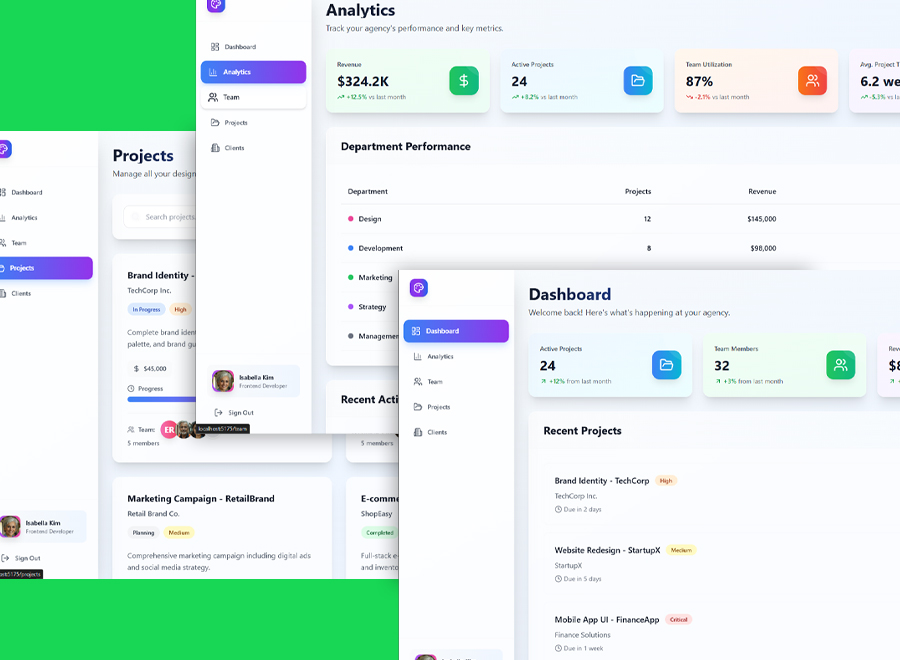

# Design Pro Dashboard

This project was based from a dashboard web app project I did for my client. I had to recreate this to refresh myself in using **Tailwind CSS** with **React**. This is only a frontend project using **data.js** and you can login using demo credentials. Login and logout was initialized using **React Context API**.

## 🚀 Features

- ⚛️ Built with **React** and **Vite** for fast performance and modern development
- 💅 Styled with **Tailwind CSS** for a responsive and utility-first design
- 🧭 **React Router DOM** for client-side routing
- 🔍 **useSearchParams** for dynamic URL-based multiple filtering



[Live Demo](https://design-pro-dashboard.netlify.app/)

## 🛠️ Technogies

  

## 🛠️ Tools

 

## 📂 Project Structure

```
├── public/
├── src/
│   ├── components/
│   ├── data.js
│   ├── App.jsx
│   └── main.jsx
├── tailwind.config.js
├── vite.config.js
└── index.html
```

## 📦 Installation

1. Clone the repository:

```bash
git clone https://github.com/kennyestrellaworks/design-po-dashboard
cd design-pro-dashboard
```

2. Install dependencies:

```bash
npm install
# or
yarn install
```

3. Start the development server:

```bash
npm run dev
# or
yarn dev
```

4. Open your browser and visit:

```
http://localhost:5173
```

## 🔎 URL-Based Filtering

This app uses `useSearchParams` to handle advanced filtering directly through URL query parameters.

Example:

```
http://localhost:5173/projects?search=brand&status=Planning&priority=Medium
```

Multiple filters can be applied simultaneously and the UI will react to changes in the URL.

## 📄 License

This project is open-source and licensed under the [MIT License](LICENSE).
